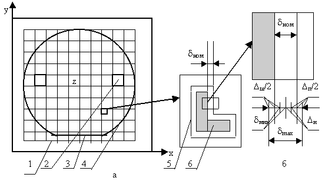

# Фотолитография

Процессы легирования, а также наращивания слоёв различных материалов формируют вертикальную физическую структуру ИМС. Необходимая форма и размер элементов и областей в каждом слое структуры обеспечиваются процессом **фотолитографии**.

**Фотолитография** — процесс избирательного травления поверхностного слоя с использованием защитной фотомаски.

На рисунке ниже приведена укрупнённая структурная схема процесса фотолитографии. Отдельные этапы на схеме включают в себя несколько операций. Ниже в качестве примера приведено описание основных операций при избирательном травлении оксида кремния (SiO2), которое используется многократно и имеет целью создание окон под избирательное легирование, а также контактных окон.  

  

**Формы приконтактных областей полупроводниковых резисторов и номограммы для определения коэффициента k**  

  

## Подготовка поверхности  

Подготовка поверхности к нанесению фотослоя заключается в её обработке парами органического растворителя для растворения жировых плёнок, которые препятствуют последующему сцеплению фоторезиста с поверхностью. Отмывка сверхчистой (деионизованой) водой удаляет следы растворителя; а также микрочастицы, способные впоследствии образовать "проколы" в тонком (ок. 1 мкм) слое фоторезиста.  

## Нанесение фотослоя  

При нанесении фотослоя используется раствор светочувствительного полимера в органическом растворителе (фоторезист). Для получения тонких слоёв фоторезиста на поверхности пластины его вязкость должна быть очень мала, что достигается высоким содержанием растворителя (80-95 % по массе). В свою очередь, с уменьшением толщины фотослоя повышается разрешающая способность фотолитографического процесса. Однако, при толщинах менее 0,5 мкм плотность дефектов ("проколов") в фотослое резко возрастает, и защитные свойства фотомаски снижаются.

Нанесение фотослоя может быть выполнено одним из двух способов: центрифугированием или распылением аэрозоля. В случае использования центрифуги дозированное количество фоторезиста подаётся в центр пластины, прижатой вакуумом к вращающейся платформе (центрифуге). Жидкий фоторезист растекается от центра к периферии, а центробежные силы равномерно распределяют его по поверхности пластины, сбрасывая излишки в специальный кожух. Толщина h нанесённой плёнки зависит от скорости вращения платформы w, от вязкости фоторезиста n и определяется соотношением:  

  

где k — коэффициент, устанавливаемый экспериментально.

Скорость вращения центрифуги около 6000 об/мин, толщина фотослоя регулируются подбором соответствующей вязкости, т.е. содержанием растворителя.

Для центрифугирования характерны следующие недостатки:  

1. Трудность получения относительно толстых (в несколько микрометров) и равномерных плёнок из-за плохой растекаемости вязкого фоторезиста.
2. Напряжённое состояние нанесённой плёнки, что приводит на этапе проявления к релаксации участков фотомаски и изменению их размеров.
3. Наличие краевого утолщения как следствие повышения вязкости в процессе выравнивания, что ухудшает контакт фотошаблона с фотослоем.
4. Трудность организации одновременной обработки нескольких пластин.
5. При распылении аэрозоли фоторезист подаётся из форсунки на пластины, лежащие на столе, совершающем возвратно-поступательное движение.  

Необходимая толщина формируется постепенно. Отдельные мельчайшие частицы растекаются и, сливаясь, образуют сплошной слой. При следующем проходе частицы приходят на частично просохший слой, несколько растворяя его. Поэтому время обработки, которое зависит от вязкости, расхода и "факела" фоторезиста, от скорости движения стола и расстояния от форсунки до подложки, устанавливается экспериментально. При реверсировании стола крайние пластины получат большую дозу фоторезиста, чем центральные. Во избежание утолщения слоя на крайних пластинах форсунке также сообщается возвратно-поступательное вертикальное движение (синхронно с движением стола). При торможении стола в конце хода форсунка поднимается вверх и плотность потока частиц в плоскости пластин снижается.

Технические характеристики установки нанесения фоторезиста центрифугированием типа АФФ-2 следующие:   

  

Технические характеристики полуавтомата нанесения фоторезиста распылением следующие:  

  

Распыление аэрозоли лишено недостатков центрифугирования, допускает групповую обработку пластин, но предъявляет более жёсткие требования к чистоте (отсутствие пыли) окружающей атмосферы. Нанесение фоторезиста и последующая сушка фотослоя являются весьма ответственными операциями, в значительной степени определяющими процент выхода качественных микросхем.  

Пылевидные частицы из окружающего воздуха могут проникать в наносимый слой и создавать микродефекты. Нанесение фотослоя должно выполнятся в условиях высокой обеспыленности в рабочих объёмах (боксах, скафандрах) 1 класса с соблюдением следующей нормы: в 1 литре воздуха должно содержатся не более четырёх частиц размером не более 0,5 мкм.  

При сушке нанесённого слоя в слое могут сохраниться пузырьки растворителя, а при выходе на поверхность слоя они могут образовать микротрещины. Поэтому сушка выполняется с помощью источников инфракрасного излучения, для которого фоторезист является прозрачным, а, следовательно, поглощение излучения с выделением тепла происходит на границе " пластина - фоторезист ". Следовательно, сушка протекает от нижних слоёв фоторезиста к верхним, обеспечивая свободное испарение растворителя. Во избежание преждевременной полимеризации (задубления) фоторезиста и потери им чувствительности температура сушки должна быть умеренной (100÷120°С).  

Перечисленные виды дефектов фотослоя (пылевидные частицы, микропузырьки и микротрещины) сохраняются в фотомаске и наследуются оксидной маской, создавая в ней микроотверстия. При использовании оксидной маски для избирательного легирования примесь будет проникать через них, образуя легированные микрообласти и, как следствие, токи утечки и пробои в p-n-переходах. Если оксидная маска представляет собой слой контактных окон, то металл, проникая в микроотверстия, может привести к паразитным связям между областями и коротким замыканиям. Характеристики некоторых марок фоторезистов приведены в таблице ниже.  

**Параметры некоторых типов фоторезистов**  

  

## Совмещение и экспонирование  

Под совмещением перед экспонированием понимается точная ориентация фотошаблона относительно пластины, при которой элементы очередного топологического слоя (на фотошаблоне) занимают положение относительно элементов предыдущего слоя (в пластине), предписанное разработчиком топологии. Например, фотошаблон, несущий рисунок эмиттерных областей должен быть точно ориентирован относительно пластины, в которой уже сформированы базовые области.

  

*а - общая схема совмещения: 1 - групповой фотошаблон; 2 - модули для грубого совмещения; 3 - базовый срез на пластине для предварительной ориентации; 4 - групповая пластина; 5 - знак совмещения в модуле пластины; 6 - знак совмещения в модуле шаблона; б- схема для расчета номинального зазора между знаками совмещения.*  

**Процесс совмещения включает три этапа:**

1. Предварительная ориентация по базовому срезу, обеспечивающую на границах модулей групповой пластины наивыгоднейшую кристаллографическую плоскость с точки зрения качества разделения пластины на отдельные кристаллы.
2. Предварительное грубое совмещение по границам крайних модулей, имеющее целью исключить разворот пластины и фотошаблона относительно вертикальной оси Z.
3. Точное совмещение, исключающее смещение рисунков фотошаблона и пластины по осям X и Y.
Для точного совмещения используют специальные знаки совмещения с контролируемым зазором, которые входят в состав топологических рисунков соответствующих слоёв. Совмещение считается выполненным, если при введении одного знака внутрь другого по всему контуру просматривается зазор.

## Проявление  

Проявление скрытого изображения для негативных фоторезистов заключается в обработке фотослоя органическим растворителем. При этом участки, не подвергшиеся облучению, растворяются, а облучённые участки, где при поглощении ультрафиолетового излучения происходит разрыв межатомных связей и перестройка структуры (фотополимеризация), сохраняются.  

В позитивных фоторезистах на участках, подвергшихся облучению, происходит разрушение структуры (деструкция) с образованием кислоты. Для перевода её в растворимые слои применяют раствор неорганического соединения со щелочными свойствами (KOH, NaOH и др).  

После отмывки от следов проявителя и сушки полученную фотомаску подвергают тепловому задубливанию (120÷180°С в зависимости от марки фоторезиста), в результате чего окончательно формируются её защитные свойства.  

## Травление  

При травлении в жидких травителях используются водные растворы неорганических соединений (обычно кислот). Химический состав и концентрация травителя в растворе подбирается так, чтобы поверхностный слой растворялся активно, а нижележащий не растворялся. С травлением в жидких травителях связано не только явление подтравливания под фотомаску, но и разброс величины подтравливания в совокупности элементов одного слоя.  

К моменту окончания растворения слоя в "окне" фотомаски боковое травление оказывается примерно равным толщине слоя, однако момент окончания травления зависит от размеров вытравливаемого элемента (окна в маске). В процессе травления имеют место отвод продуктов химической реакции от поверхности в раствор и подвод из раствора свежего травителя. Оба процесса протекают благодаря взаимодиффузии, скорость которой и определяет скорость травления. В мелких элементах массообмен затруднён и скорость травления ниже, чем в крупных элементах. Поскольку технологическое время травления устанавливают по самому мелкому элементу, более крупные элементы получают "перетрав", т.е. большие погрешности размера.  

   

Для повышения точности травления, т.е. уменьшения разброса размеров элементов из-за растрава, необходимо динамическое воздействие травителя на обрабатываемую поверхность. Для этого используется установка на основе центрифуги, снабжённой тремя форсунками для последовательного травления, отмывки (деионизированной водой) и сушки (подогретым воздухом). Форсунка для травителя обеспечивает ускоренную подачу свежего травителя к поверхности, вытесняя продукты реакции, а центробежные силы ускоряют отвод отработанного травителя. В таблице ниже приведены применяемых при производстве интегральных микросхем типы травителей.  

**Травители для некоторых материалов**  

  

Существенное повышение точности травления достигается при использовании вакуум-плазменных ("сухих") методов травления, при которых разрушение слоя происходит механически за счёт бомбардировки потоком заряженных частиц (ионов инертного газа). С этой целью в вакуумной камере при давлении газа 1÷10 Па зажигается разряд и обрабатываемая пластина в качестве катода подвергается обработке ионами с энергией до 1 кэВ. Структура полимерной фотомаски и её толщина сохраняют её защитные свойства до окончания обработки слоя. Поскольку движение ионов инертного газа (обычно аргона) происходит по нормали к поверхности пластины, вытравленные участки точно соответствуют размерам окон фотомаски, т.е. эффект подтравливания отсутствует.