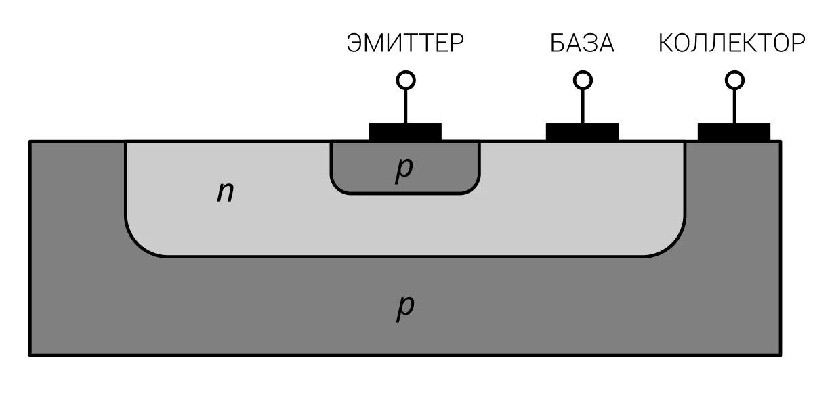
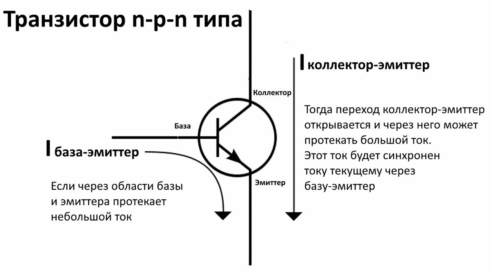

# Принцип работы транзистора

> **Транзистор** — полупроводниковый прибор, способный управлять **большим** выходным током с помощью **небольшого** входного сигнала. Это свойство транзистора позволяет применять его для усиления, генерирования, коммутации и преобразования электрических сигналов.  

Транзистор — основа всех интегральных микросхем. Например, в процессоре Apple A13 Bionic, который находится внутри Iphone 11, 8,5 миллиарда транзисторов!

Транзисторы бывают полевыми и биполярными. В чем же отличие между полевыми и биполярными транзисторами? Ответ заложен в их названиях. В биполярном транзисторе в переносе заряда участвуют **и** электроны, **и** дырки («бис» — дважды). А в полевом — **или** электроны, **или** дырки. Биполярные транзисторы используются, в основном, в аналоговой схемотехнике, а полевые — в цифровой.  

Рассмотрим биполярный транзистор. Он состоит из монокристалла, разделенного на 3 зоны: база (Б), коллектор (К) и эмиттер (Э), каждая из которых имеет свой вывод.  

  

**Б** – база, очень тонкий внутренний слой. Базу изготавливают из слаболегированного полупроводника (из-за чего она имеет большое сопротивление);
**Э** – эмиттер, предназначается для переноса заряженных частиц в базу;
**К** – коллектор, составляющая, которая имеет тип проводимости, одинаковый с эмиттером, предназначена для сбора зарядов, поступивших с эмиттера.  

На рисунках показано, как устроены структуры p-n-p и n-p-n. 

Предположим, что между эмиттером и коллектором течет достаточно большой величины ток (**ток коллектора**), а между базой и эмиттером — достаточно слабый управляющий ток (**ток базы**). *Ток коллектора будет меняться в зависимости от изменения тока базы*. Почему так происходит? Рассмотрим p-n переходы в транзисторе: эмиттер-база (ЭБ) и база-коллектор (БК). В активном режиме работы транзистора первый из них подключается с прямым, а второй — с обратным смещением. Что происходит при этом на p-n переходах? Для большей определенности будем рассматривать n-p-n транзистор. Для p-n-p все аналогично, только вместо электронов в процессе участвуют, так называемые, дырки.   

Поскольку переход ЭБ открыт, то электроны легко переходят в базу. Там они частично рекомбинируют с дырками, но большая их часть всё-таки успевает добраться до перехода БК. Этот переход включен с обратным смещением. А поскольку в базе электроны — это неосновные носители заряда, то электирическое поле перехода помогает им преодолеть его. Таким образом, ток коллектора получается лишь немного меньше тока эмиттера. Если увеличить ток базы, то переход ЭБ откроется больше, и между эмиттером и коллектором сможет пройти большее количество электронов. А поскольку ток коллектора изначально больше тока базы, то это изменение будет **заметным**. Таким образом, произойдет **усиление** слабого сигнала, поступившего на базу.  

> При небольшом изменении тока базы, сильно меняется ток коллектора.  

Cоотношение тока коллектора к току базы называется **коэффициентом усиления по току**. 

Принцип работы биполярного транзистора можно объяснить на примере водопроводного крана. Вода в нем — ток коллектора, а управляющий ток базы — это то, на сколько сильно мы поворачиваем ручку. Ведь достаточно небольшого усилия, чтобы поток воды из крана увеличился.

