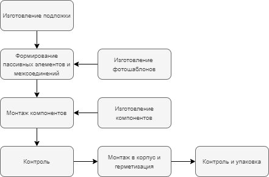

# Технология изготовления микросхем
**Микросхемы** являются неотъемлемой частью большинства электронных устройств, определяя их характеристики и качество. Технология изготовления микросхем играет важную роль в обеспечении их надёжности и эффективности. В этом разделе представлена информация о процессе производства микросхем.  

**1. Общие сведения о микросхемах и технологии их изготовления.**

**Микросхемой (интегральной микросхемой — ИМС, интегральной схемой - ИС)** называют функционально законченный электронный узел (модуль), элементы и соединения в котором конструктивно неразделимы и изготовлены одновременно в едином технологическом процессе на общей пластине.  

По конструктивно-технологическому исполнению микросхемы делятся на *полупроводниковые* и *гибридно-пленочные*. Полупроводниковые микросхемы имеют в своей основе монокристалл полупроводникового материала (например, кремния), в поверхностном слое которого с помощью литографии и избирательного легирования создаются транзисторы, диоды, резисторы и (иногда) конденсаторы, а соединения между ними формируются по поверхности кристалла с помощью тонкоплёночной технологии.  

В качестве активных элементов в полупроводниковых микросхемах используются униполярные (полевые) транзисторы со структурой **“металл – диэлектрик (оксид) – полупроводник”** (МДП- или МОП-транзисторы) и биполярные транзисторы.  

**Cхема технологического процесса изготовления полупроводниковых (монолитных) ИС"**

 ИС")  

**Cхема технологического процесса изготовления гибридно-пленочных ИС**

     
