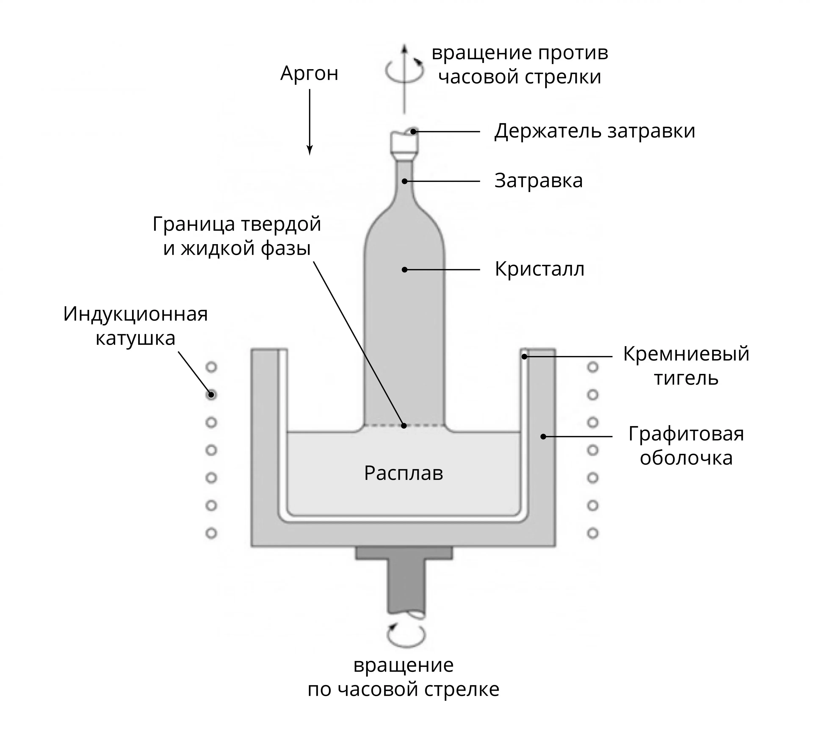

# Выращивание кристалла методом Чохральского  
**Монокристалл** –  однородный кристалл, имеющий во всем объеме единую кристаллическую решетку и зависимость физических свойств от направления (анизотропия). Электрические, магнитные, оптические, акустические, механические и другие свойства монокристалла связаны между собой и обусловлены его кристаллической структурой, силами связи между атомами и энергетическим спектром электронов.  

Монокристаллы для полупроводниковой промышленности (кремний, германий, рубин, гранаты, фосфид и арсенид галлия, ниобат лития и др.) изготавливаются, как правило, методом Чохральского путем вытягивания из расплава с помощью затравки.  

На рисунке ниже приведена схема установки для выращивания монокристаллов по методу Чохральского.  

**Метод Чохраальского** – получение (выращивание) монокристалла медленным вытягиванием его из расплава с помощью заранее полученного затравочного кристалла.  

Затравку закрепляют на водоохлаждаемом стержне, опускают в расплав, а затем медленно вытягивают при непрерывном вращении стержня. Процесс проводят в вакууме или в атмосфере инертного газа в водоохлаждаемой кристаллизационной установке.

Метод Чохральского позволяет задавать форму монокристалла и получать слитки необходимых размеров и геометрии, регулировать их качество (дефектность) путём изменения скоростей вращения и вытягивания затравки. Монокристалл растет на затравке со скоростью до 80 мм/ч. Расплав смачивает затравку и удерживается на ней силами поверхностного натяжения. 

Получаемые методом Чохральского монокристаллы имеют циллиндрическую форму длиной около 2 м, диаметром 300 мм и массой 265 кг.