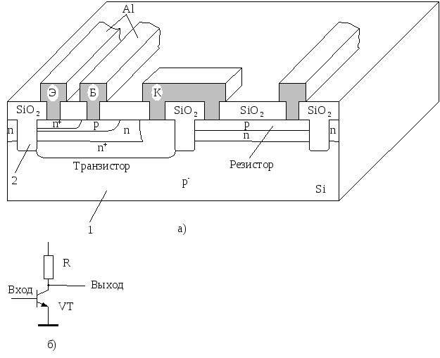

# Понятие о структуре и топологии полупроводниковых микросхем

Конструкция полупроводниковой микросхемы полностью определяется её физической структурой (совокупностью слоёв в кристалле, отличающихся материалом и электрофизическими свойствами) и топологией (формой, размерами, относительным расположением отдельных областей и характером межсоединений по поверхности кристалла). Можно также сказать, что структура – это чертёж поперечного сечения кристалла интегральной микросхемы, а топология – вид в плане.   

 **Фрагмент структуры интегральной микросхемы**
 

Каждый из слоёв представляет собой совокупность отдельных областей, имеющих одинаковые толщины, тип проводимости (электронная n или дырочная p) и характер распределения примеси по толщине. Это достигается одновременным введением примеси через окна защитной маски из SiO2, формируемой предварительно на поверхности пластины-кристалла. Верхние слои получают путём формирования сплошной плёнки и последующего избирательного травления с использованием фотошаблона.  

Приведённая структура получила название эпитаксиально-планарной и предполагает взаимную изоляцию смежных элементов за счёт обратносмещенных p-n-переходов на границах изолирующего слоя. Высоколегированный скрытый слой (n+) служит для уменьшения сопротивления коллекторов транзисторов, что влечет за собой повышение их быстродействия. Области n+ под коллекторными контактами исключают образование потенциального барьера (барьера Шоттки) и обеспечивают омический контакт со слаболегированным коллектором.