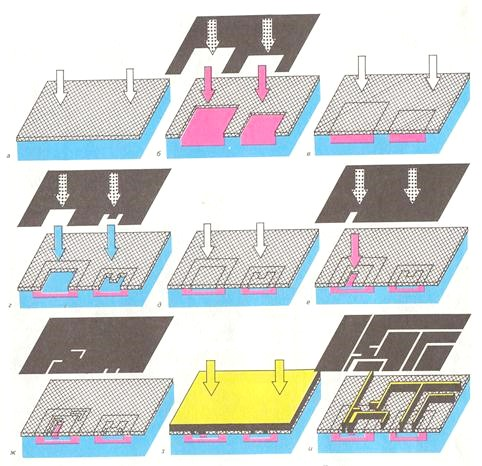

# Цикл формирования топологических слоёв полупроводниковых микросхем  

Нижние слои, находящиеся в объёме полупроводникового кристалла, формируются с помощью однотипного повторяющегося цикла:   

**Окисление поверхности (SiO2) → фотолитография с образованием оксидной маски → внедрение легирующей примеси через окна маски → стравливание окисла**

Рисунок оксидной маски определяется рисунком фотошаблона, используемого в процессе фотолитографии. Таким образом, для создания всех слоёв требуется комплект фотошаблонов с различными рисунками.  

В исходной пластине-подложке p-типа формируются области скрытого слоя (n+). Далее осаждается сплошной монокристаллический (эпитаксиальный) слой кремния n-типа, поверхность которого окисляется. Затем формируются области разделительного слоя (p+) с таким расчётом, чтобы они сомкнулись с подложкой. Образующиеся при этом островки эпитаксиального слоя образуют коллекторный слой (n). Внутри коллекторных областей формируются базовые p-области (базовый слой), а внутри базовых областей – эмиттерные (эмиттерный n+-слой).  

В дальнейшем? обработка происходит на поверхности: формируются изолирующий слой (SiO2), слой металлизации (Al) и защитный слой (SiO2). При этом используется цикл **нанесение сплошной плёнки → фотолитография**.