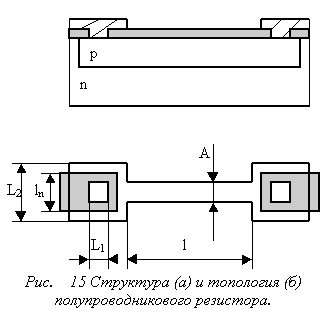

# Проектирование полупроводниковых резисторов

Структура и топология резистора, сформированного в полупроводниковом материале, приведены на рисунке ниже. Сопротивление резистора складывается из сопротивления линейной части, которое подчиняется выражению R=Rсл×l/a, и сопротивления приконтактных областей, которое определяется через эмпирический коэффициент k, выраженный в долях Rсл.
