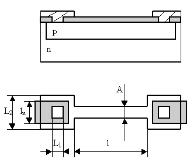
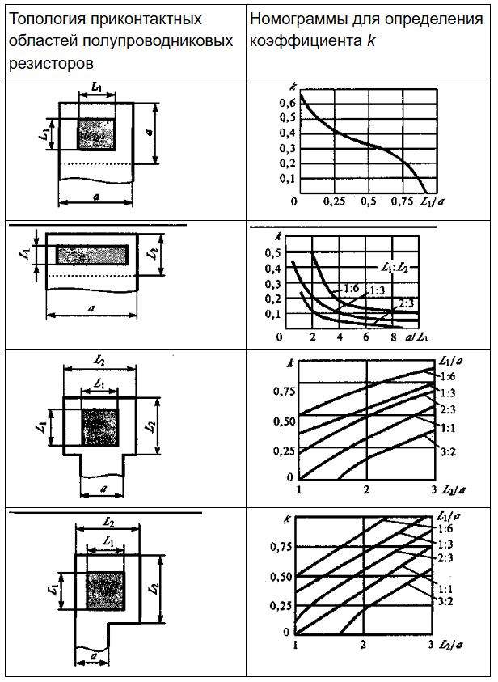

# Проектирование полупроводниковых резисторов

Структура и топология резистора, сформированного в полупроводниковом материале, приведены на рисунке ниже. Сопротивление резистора складывается из сопротивления линейной части, которое подчиняется выражению R=Rсл × l/a, и сопротивления приконтактных областей, которое определяется через эмпирический коэффициент k, выраженный в долях Rсл.  

  

  

Коэффициент k зависит от формы и размеров приконтактной области и ширины а линейной части резистора. Он определяется по номограммам, приведенным в таблице ниже. Размер а должен быть минимально возможным, но следует учитывать возможности технологии и требования точности сопротивления (с уменьшением ширины точность уменьшается).  

  

Для расчета минимальных размеров приконтактных областей используются правила, справедливые для расчета областей транзистора.  После определения а и k определяют длину l линейной части резистора. Для формирования резисторов могут быть использованы любые слои физической структуры ИМС. В практике проектирования и производства находят применение резисторы на основе эмиттерного слоя (сопротивления в несколько десятков Ом), базового слоя (от сотен до нескольких тысяч Ом), слоя активной базы (десятки тысяч Ом, так называемые "ПИНЧ-резисторы").
